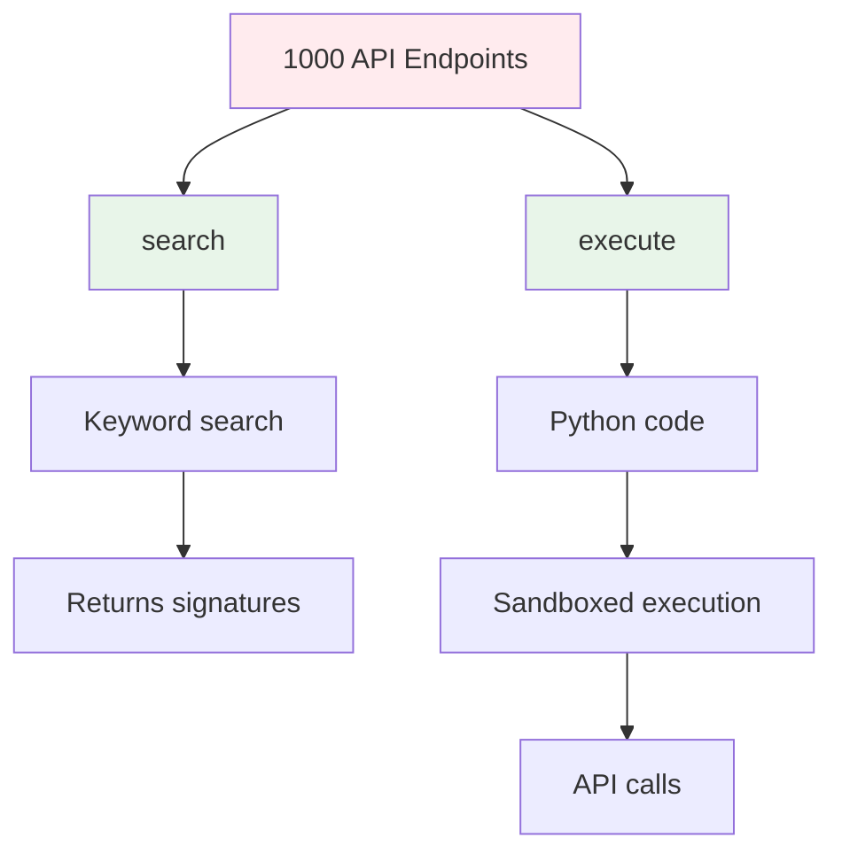

Code mode transforms large API tool sets into just two tools: `search` and `execute`. This reduces context size from potentially thousands of tools to a constant 2 tools, achieving ~99.9% token reduction.

## The Problem

Large APIs can have hundreds or thousands of endpoints. Exposing each as a separate tool leads to:

<CardGroup cols={3}>
  <Card title="Token Explosion" icon="explosion">
    1000 endpoints = 1000 tool definitions in context
  </Card>
  <Card title="Context Limits" icon="triangle-exclamation">
    Exceeds model context windows
  </Card>
  <Card title="High Costs" icon="dollar-sign">
    Massive token consumption per request
  </Card>
</CardGroup>

## The Solution

Code mode replaces N tools with exactly 2 tools:



### How It Works

Instead of exposing individual tools, the model:

<Steps>
  <Step title="Search for endpoints">
    Use the `search` tool to find relevant API functions by keyword
  </Step>
  <Step title="Write Python code">
    Call discovered functions using Python syntax
  </Step>
  <Step title="Execute in sandbox">
    Code runs in a secure Monty interpreter that calls actual API endpoints
  </Step>
</Steps>

## The Two Tools

### 1. Search Tool

Discovers available API endpoints by keyword (`code-mode.ts:170`):

```typescript
search(query: string) → string
```

<CodeGroup>
```typescript Usage
const result = await search({ query: "user" });
```

```text Output
listUsers(limit: float = None, offset: float = None)
  List all users in the system
  Example: listUsers(limit=10)

getUser(id: str)
  Get user by ID
  Example: getUser(id="123")

createUser(name: str, email: str)
  Create a new user
  Example: createUser(name="...", email="...")
```
</CodeGroup>

#### Search Index

The search tool builds an index of all available endpoints (`code-mode.ts:50`):

```typescript
interface ToolIndexEntry {
  originalName: string;  // e.g., "list-users"
  pyName: string;        // e.g., "list_users"
  description: string;
  signature: string;     // e.g., "list_users(limit: float = None)"
  example: string;       // e.g., "list_users(limit=10)"
  searchText: string;    // Lowercased for matching
}
```

<Info>
  Tool names are automatically converted to Python-safe identifiers: hyphens become underscores, names starting with digits get prefixed with `_`.
</Info>

### 2. Execute Tool

Runs Python code that calls API endpoints (`code-mode.ts:205`):

```typescript
execute(code: string) → unknown
```

<CodeGroup>
```python Single Call
user = getUser(id="123")
user
```

```python Multiple Calls
users = listUsers(limit=10)
first_user = getUser(id=users[0]["id"])
first_user
```

```python Data Processing
users = listUsers(limit=100)
active = [u for u in users if u["status"] == "active"]
len(active)
```
</CodeGroup>

#### Sandboxed Execution

Code runs in a Monty interpreter (`code-mode.ts:222`) with:

<AccordionGroup>
  <Accordion title="Security">
    - No file system access
    - No network access (except registered API functions)
    - 30-second execution timeout
    - Memory limits
  </Accordion>
  
  <Accordion title="Capabilities">
    - Full Python syntax (loops, comprehensions, etc.)
    - Call any discovered API function
    - Process and transform results
    - Return any JSON-serializable value
  </Accordion>
</AccordionGroup>

## Token Reduction Math

### Standard Mode

```
1000 endpoints × ~200 tokens/tool = ~200,000 tokens
```

### Code Mode

```
2 tools × ~100 tokens/tool = ~200 tokens
```

<Card title="99.9% Reduction" icon="chart-line">
  200,000 tokens → 200 tokens = **99.9% reduction**
</Card>

## When to Use Code Mode

Use code mode when:

<CardGroup cols={2}>
  <Card title="Large APIs" icon="check" color="#10B981">
    More than ~50 endpoints
  </Card>
  <Card title="Discovery Pattern" icon="check" color="#10B981">
    User doesn't know exact endpoints
  </Card>
  <Card title="Multi-Step Workflows" icon="check" color="#10B981">
    Chaining multiple API calls
  </Card>
  <Card title="Data Processing" icon="check" color="#10B981">
    Filtering or transforming results
  </Card>
</CardGroup>

<Warning>
  Code mode adds latency due to the search → code generation → execution flow. For small APIs (under 50 endpoints) or when you know the exact endpoint, standard mode is faster.
</Warning>

## Implementation

Convert your tools to code mode:

```typescript
import { toCodeModeTools } from '@spec2tools/core';
import { toAISDKTools } from '@spec2tools/core';

// Create standard tools
const standardTools = toAISDKTools(tools);

// Convert to code mode (1000 tools → 2 tools)
const codeModeTools = toCodeModeTools(standardTools);

// Use with AI SDK
const result = await generateText({
  model: openai('gpt-4'),
  tools: codeModeTools,
  prompt: 'List all active users',
});
```

## Example: Real-World Usage

Here's a complete flow using the GitHub API:

<Steps>
  <Step title="Model searches for endpoints">
    ```typescript
    await search({ query: "repository issues" })
    ```
    Returns: `listIssues(owner: str, repo: str, state: str = None)`
  </Step>
  
  <Step title="Model writes Python code">
    ```python
    issues = listIssues(owner="octocat", repo="hello-world", state="open")
    bug_issues = [i for i in issues if "bug" in i.get("labels", [])]
    len(bug_issues)
    ```
  </Step>
  
  <Step title="Code executes in sandbox">
    - Calls `listIssues` API endpoint
    - Filters results in Python
    - Returns count
  </Step>
</Steps>

## Error Handling

The execute tool handles errors gracefully (`code-mode.ts:273`):

<Tabs>
  <Tab title="Syntax Error">
    ```python
    def +++(  # Invalid syntax
    ```
    Returns: `Syntax Error: unexpected token`
  </Tab>
  
  <Tab title="Runtime Error">
    ```python
    getUser(id="nonexistent")
    ```
    Returns:
    ```
    Runtime Error: HTTP 404 Not Found
    URL: GET https://api.example.com/users/nonexistent
    Response: {"error": "User not found"}
    ```
  </Tab>
  
  <Tab title="Type Error">
    ```python
    getUser(id=123)  # Should be string
    ```
    Returns: `Type Error: expected str, got int`
  </Tab>
</Tabs>

## Name Conversion

API tool names are converted to valid Python identifiers (`code-mode.ts:31`):

```typescript
// Original → Python
"list-users"      → "list_users"
"get.user"        → "get_user"
"resolve library" → "resolve_library"
"2fa-enable"      → "_2fa_enable"  // Prefix with _ if starts with digit
```

Both the original and Python names are searchable:

```typescript
await search({ query: "list-users" })  // ✓ Works
await search({ query: "list_users" })  // ✓ Works
```

## Performance Characteristics

<CardGroup cols={2}>
  <Card title="Context Size" icon="memory">
    **Constant**: Always 2 tools regardless of API size
  </Card>
  <Card title="Latency" icon="clock">
    **Higher**: Search + code generation + execution
  </Card>
  <Card title="Flexibility" icon="wand-magic-sparkles">
    **Maximum**: Can combine and process results
  </Card>
  <Card title="Cost" icon="coins">
    **Lower**: Minimal tokens per request
  </Card>
</CardGroup>

## Next Steps

<CardGroup cols={2}>
  <Card title="Authentication" icon="key" href="/concepts/authentication">
    Learn how auth works with code mode
  </Card>
  <Card title="Using the SDK" icon="code" href="/guides/using-the-sdk">
    Implement code mode in your application
  </Card>
</CardGroup>
