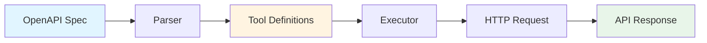

Spec2Tools transforms OpenAPI specifications into executable AI tools through a three-stage architecture: parsing, tool creation, and execution.

## Architecture Overview



## Stage 1: OpenAPI Parsing

The parser (`openapi-parser.ts:22`) loads and validates OpenAPI specifications from URLs or local files:

<CodeGroup>
```typescript Load Spec
import { loadOpenAPISpec } from '@spec2tools/core';

// From URL
const spec = await loadOpenAPISpec('https://api.example.com/openapi.json');

// From file
const spec = await loadOpenAPISpec('./openapi.yaml');
```
</CodeGroup>

The parser:
- Supports both JSON and YAML formats
- Extracts base URLs from server definitions (`openapi-parser.ts:53`)
- Parses authentication schemes (`openapi-parser.ts:63`)
- Converts OpenAPI schemas to Zod schemas (`openapi-parser.ts:194`)

### Schema Conversion

OpenAPI schemas are converted to Zod for runtime validation:

```typescript
// OpenAPI schema → Zod schema
type: "string" → z.string()
type: "integer" → z.number()
type: "array" → z.array(...)
type: "object" → z.object({ ... })
```

<Info>
  The parser handles nested objects up to 1 level deep and automatically resolves `$ref` references to component schemas.
</Info>

## Stage 2: Tool Creation

The `parseOperations` function (`openapi-parser.ts:447`) transforms each API endpoint into a tool definition:

```typescript
interface Tool {
  name: string;              // Operation ID or generated name
  description: string;       // From summary/description
  parameters: z.ZodObject;   // Combined path, query, and body params
  httpMethod: HttpMethod;    // GET, POST, PUT, PATCH, DELETE
  path: string;              // API path with {params}
  authConfig: AuthConfig;    // Authentication configuration
}
```

### Parameter Handling

Parameters from different sources are combined into a single schema (`openapi-parser.ts:303`):

<Steps>
  <Step title="Path Parameters">
    Extracted from URL patterns like `/users/{id}`
  </Step>
  <Step title="Query Parameters">
    Added to the URL query string
  </Step>
  <Step title="Body Parameters">
    Sent as JSON in the request body (POST, PUT, PATCH)
  </Step>
</Steps>

The `parameterMetadata` field tracks which parameters belong to each category:

```typescript
parameterMetadata: {
  pathParams: Set<string>,   // e.g., {"id"}
  queryParams: Set<string>,  // e.g., {"limit", "offset"}
  bodyParams: Set<string>    // e.g., {"name", "email"}
}
```

## Stage 3: Execution

The executor (`tool-executor.ts:33`) creates executable functions that handle HTTP requests:

```typescript
const executor = createExecutor(tool, baseUrl, authManager);
const result = await executor({ id: "123", limit: 10 });
```

### Execution Flow

<Steps>
  <Step title="Validate Parameters">
    Zod validates input against the schema (`tool-executor.ts:41`)
  </Step>
  <Step title="Build URL">
    Replace path parameters and construct the full URL (`tool-executor.ts:154`)
  </Step>
  <Step title="Add Authentication">
    Inject auth headers or query parameters (`tool-executor.ts:76`)
  </Step>
  <Step title="Execute Request">
    Send HTTP request with appropriate method and body (`tool-executor.ts:95`)
  </Step>
  <Step title="Parse Response">
    Extract JSON or text from the response (`tool-executor.ts:102`)
  </Step>
</Steps>

### Error Handling

The executor provides detailed error messages with context (`tool-executor.ts:110`):

```typescript
HTTP 401 Unauthorized
URL: GET https://api.example.com/users/123
Response: {"error": "Invalid API key"}
Authentication failed. Check your API key/token.
```

<Warning>
  Failed requests throw `ToolExecutionError` with the HTTP status, response body, and helpful suggestions based on the status code.
</Warning>

## Dynamic Tool Discovery

Unlike static tool definitions, Spec2Tools generates tools dynamically from OpenAPI specs:

<CardGroup cols={2}>
  <Card title="Traditional Approach" icon="code">
    - Manually write tool definitions
    - Update code for API changes
    - Maintain separate docs
  </Card>
  <Card title="Spec2Tools Approach" icon="wand-magic-sparkles">
    - Auto-generate from OpenAPI
    - Changes update automatically
    - Spec is the source of truth
  </Card>
</CardGroup>

## Example: Complete Flow

Here's how a single API call flows through the system:

```typescript
// 1. Load spec
const spec = await loadOpenAPISpec('https://api.example.com/openapi.json');

// 2. Parse operations → tools
const toolDefs = parseOperations(spec);
// Result: [{ name: "getUser", parameters: z.object({id: z.string()}), ... }]

// 3. Create executable tools
const tools = createExecutableTools(toolDefs, baseUrl, authManager);

// 4. Execute
const user = await tools[0].execute({ id: "123" });
// HTTP GET https://api.example.com/users/123
// Response: { id: "123", name: "Alice" }
```

## Supported Features

<AccordionGroup>
  <Accordion title="Supported Schema Features">
    - Primitive types: string, number, integer, boolean
    - Arrays of primitives
    - Objects with properties (1 level deep)
    - Enums
    - Optional and required fields
    - $ref resolution for component schemas
  </Accordion>
  
  <Accordion title="Unsupported Features">
    - anyOf, oneOf, allOf (throws `UnsupportedSchemaError`)
    - Arrays of objects
    - Nested objects beyond 1 level
    - File uploads (binary format)
    - Circular references
  </Accordion>
</AccordionGroup>

## Next Steps

<CardGroup cols={2}>
  <Card title="Code Mode" icon="terminal" href="/concepts/code-mode">
    Learn how to reduce token usage by 99.9% with code mode
  </Card>
  <Card title="Authentication" icon="key" href="/concepts/authentication">
    Understand authentication handling
  </Card>
</CardGroup>
